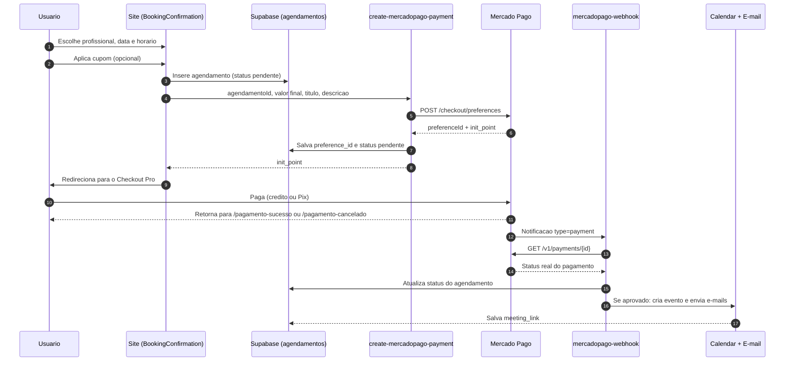
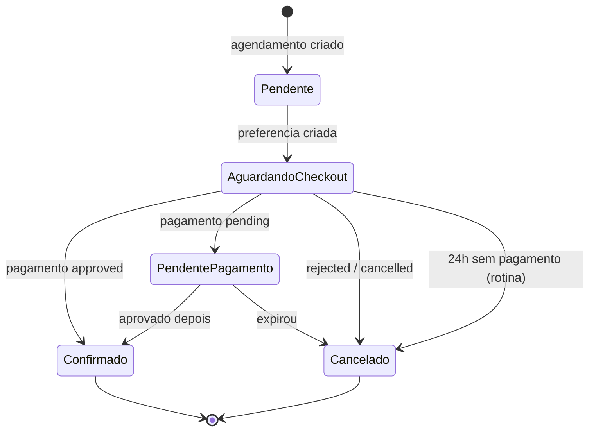

# Sistema de Pagamentos — Rede Bem-Estar

Documentação do funcionamento atual do fluxo de pagamento do site.

---

## 1. Visão geral

Todo o pagamento é processado pelo **Mercado Pago**, no modelo **Checkout Pro** (criação de uma *preference* e redirecionamento do usuário para o checkout hospedado pelo Mercado Pago).

- O site **não** captura dados de cartão. Não há tokenização local nem PCI no nosso lado.
- O pagamento está sempre vinculado a um **agendamento de consulta** (tabela `agendamentos`).
- A confirmação é assíncrona, via **webhook** do Mercado Pago.

Não existe hoje: assinatura/recorrência, split de pagamento entre plataforma e profissional, cobrança de planos institucionais, carteira ou saldo.

---

## 2. Componentes e páginas envolvidas

| Camada | Arquivo | Papel |
| --- | --- | --- |
| Confirmação de agendamento | `src/pages/BookingConfirmation.tsx` | Coleta dados, aplica cupom, cria o agendamento, chama a criação da preferência e redireciona ao checkout |
| Validação de cupom | `src/components/CouponValidator.tsx`, `src/components/AvailableCouponsDisplay.tsx` | Aplica desconto antes do pagamento |
| Registro de uso do cupom | `src/hooks/useCouponTracking.ts` | Registra uso vinculado ao agendamento |
| Retorno de sucesso/pendente | rota `/pagamento-sucesso` (`PaymentSuccess`) | Página de retorno pós-checkout |
| Retorno de falha | rota `/pagamento-cancelado` (`PaymentCancelled`) | Página de retorno em falha/cancelamento |
| Meus agendamentos | `src/pages/MyAppointments.tsx` | Exibe status do pagamento/consulta |

As rotas existem tanto na raiz (`/pagamento-sucesso`) quanto em variantes por tenant (ex.: `/medcos/pagamento-sucesso`), definidas em `src/App.tsx`.

---

## 3. Edge Functions

### 3.1 `create-mercadopago-payment`
Entrada: `{ agendamentoId, valor, title, description }`.

O que faz:
1. Lê o token `MERCADO_PAGO_ACCESS_TOKEN`.
2. Monta a preferência com:
   - 1 item, moeda `BRL`, `unit_price = valor`;
   - `payment_methods.excluded_payment_types`: **cartão de débito** (`debit_card`) e **boleto** (`ticket`) ficam excluídos;
   - `installments: 12` (parcelamento em até 12x no crédito);
   - `external_reference = agendamentoId` (chave de reconciliação);
   - `notification_url` apontando para `mercadopago-webhook`;
   - `auto_return: "approved"`;
   - `back_urls` de sucesso, falha e pendente com o `agendamento` na query string.
3. `POST https://api.mercadopago.com/checkout/preferences`.
4. Grava `mercado_pago_preference_id` no agendamento e define `status = 'pendente'`.
5. Retorna `{ preferenceId, initPoint, sandboxInitPoint }`.

O frontend redireciona para `initPoint` via `window.location.href`.

### 3.2 `mercadopago-webhook`
Recebe as notificações do Mercado Pago. Quando `body.type === 'payment'`:

1. Busca o pagamento em `GET /v1/payments/{id}` para confirmar o estado real (não confia no payload).
2. Recupera o agendamento por `external_reference`.
3. Mapeia o status (ver seção 5) e atualiza `agendamentos.status`.
4. Se **aprovado**:
   - tenta criar evento no Google Calendar via `create-calendar-event` e, se houver `meetLink`, salva em `agendamentos.meeting_link`;
   - dispara `send-appointment-notification` (e-mails para paciente/estudante, profissional e cópias configuradas).
   - falhas de calendário ou e-mail são registradas em log e **não** revertem o pagamento.

### 3.3 `auto-cancel-unpaid-appointments`
Rotina de limpeza: cancela agendamentos com `status = 'pendente'` e `payment_status = 'pending_payment'` criados há mais de **24 horas**, notificando por e-mail (Resend).

### 3.4 Funções relacionadas
`cancel-appointment` e `reschedule-appointment` também consultam dados de Mercado Pago do agendamento ao tratar cancelamento/remarcação.

---

## 4. Dados persistidos

Na tabela `agendamentos`, os campos relevantes ao pagamento:

- `id` — usado como `external_reference` no Mercado Pago;
- `mercado_pago_preference_id` — id da preferência criada;
- `status` — estado do agendamento (atualizado pelo webhook);
- `payment_status` — estado do pagamento (usado, por exemplo, por `auto-cancel-unpaid-appointments`);
- `valor` — valor cobrado (já com cupom aplicado, quando houver);
- `meeting_link` — link do Google Meet gerado após aprovação.

O uso de cupom é registrado em tabela própria de usos, com `originalAmount`, `discountAmount` e `finalAmount` (ver `docs/CUPONS_SISTEMA.md`).

---

## 5. Estados

Mapeamento aplicado pelo webhook:

| Status Mercado Pago | `agendamentos.status` |
| --- | --- |
| `approved` | `confirmado` |
| `pending` | `pendente_pagamento` |
| `cancelled` / `rejected` | `cancelado` |
| qualquer outro | `pendente` |

Fluxo do agendamento:

```text
criado (pendente)
   -> preferência criada (pendente + preference_id)
      -> checkout aprovado  -> confirmado -> calendário + e-mails
      -> checkout pendente  -> pendente_pagamento
      -> recusado/cancelado -> cancelado
      -> sem retorno em 24h -> cancelado (rotina automática)
```

---

## 6. Cupons e valor final

1. O usuário pode aplicar cupom manualmente ou receber um cupom já na URL (`couponCode`, `couponDiscount`, `couponFinal`).
2. O valor enviado ao Mercado Pago é `appliedCoupon.finalAmount` quando existe cupom, senão o preço original do profissional.
3. A descrição da cobrança inclui o código do cupom e a economia, para aparecer na fatura/checkout.
4. O uso do cupom é registrado após a criação do agendamento, antes do redirecionamento ao checkout.

---

## 7. Secrets e variáveis

| Nome | Uso |
| --- | --- |
| `MERCADO_PAGO_ACCESS_TOKEN` | Autenticação na API do Mercado Pago (criação de preferência e consulta de pagamento) |
| `APP_BASE_URL` | Base das `back_urls` (fallback: `https://alopsi.com.br`) |
| `SUPABASE_URL` | Base do `notification_url` e chamadas internas entre funções |
| `SUPABASE_SERVICE_ROLE_KEY` | Atualização de agendamentos pelo webhook (bypass de RLS) |
| `SUPABASE_ANON_KEY` | Chamada das funções de calendário e e-mail |
| `RESEND_API_KEY` | Envio de e-mails transacionais |

---

## 8. Diagramas

### 8.1 Fluxo principal



### 8.2 Máquina de estados



### 8.3 Versão ASCII

```text
Usuario -> Site -> [insere agendamento: pendente]
                -> create-mercadopago-payment -> Mercado Pago (preference)
                <- init_point
        -> redireciona -> Checkout Pro -> pagamento
                                          |
        back_urls <---------------------- + --------> webhook
        /pagamento-sucesso                             |
        /pagamento-cancelado                    consulta /v1/payments
                                                       |
                                        atualiza status do agendamento
                                                       |
                                     aprovado -> Google Calendar + e-mails
```

---

## 9. Observações e limitações conhecidas

1. **Sem verificação de assinatura do webhook.** A função aceita qualquer chamada, mas mitiga o risco consultando o pagamento diretamente na API do Mercado Pago antes de atualizar o banco.
2. **Convidados**: é possível iniciar o fluxo sem login (com modal de cadastro rápido); o pagamento segue mesmo assim.
3. **Sucesso e pendente compartilham a mesma página** (`/pagamento-sucesso`), então um Pix ainda não creditado exibe a tela de sucesso.
4. **Débito e boleto estão desativados** na preferência.
5. **Parcelamento** liberado em até 12x no crédito.
6. **`APP_BASE_URL` com fallback fixo** para `alopsi.com.br`: se a variável não estiver definida, o retorno pós-checkout sai do domínio do tenant.
7. Não há tela administrativa de conciliação/reembolso — estornos são feitos no painel do Mercado Pago.
